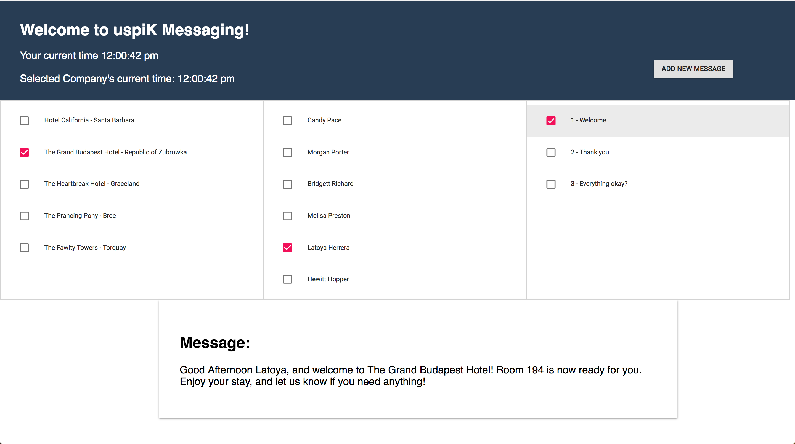

# Hotel Messaging App
## Hand-crafted by Atticus Pomerantz

## To Run: 
- Clone/download repository
- Run `npm install`
- Run `npm start`
- Project will run on localhost:3000

## Design Decisions:
I had a lot of fun working on this project! In particular I enjoyed the challenge of using a single Checklist component to create three different checklists on the DOM based on the JSON input passed to them. This seemed like the best way to use the OOP principles built into React.js.  

Certainly the most difficult part of the project was allowing the user to create new message templates - I had never encoutered a situation where users were interacting with variables and it was fun trying to design a UI that would be accessible to both software developers and hotel administrators. I decided to allow the user to use key words (guestFirstName, guestRoomNumber, hotelCity, etc.) in place of actual code variables (this.state.guest.firstName) because I thought it would be more user-friendly. The app then uses a .replace() string method to insert the desired variables. 

I chose to use React.js for a few reasons: 
- I know OOP programming is important for this position and React.js is heavily dependant on OOP principles.
- I've been using it every day for the past month so it's what I'm currently most cofident in.
- Create-React-App allowed me to quickly spin up a new project.

## Verifying the program:
Personal testing and demoing the project for a friend allowed me to verify the application worked as expected. With additional time I think the functionality for adding templates could be greatly streamlined but it works well in its current form. 

## Next Steps: 
- Streamline the process for adding a template. It would be nice to have a method to visually highlight the variables added by the user in real time (perhaps by coloring the text red). 
- Edit and delete templates.
- Integrate with a server/database so data persists page refresh. 
- Refactor the populateMessage() function - I think there must be a more elegant solution than a series of .replace() methods but that but was what I ended up using.
- Refactor the selectSalutation() function - It should easily be able to accept all possible timezones, not just the three provided here. 
- Additional styling, specifically mobile devices. I also think the 'Add New Message' button should (at least appear to be) part of the template checklist component. 